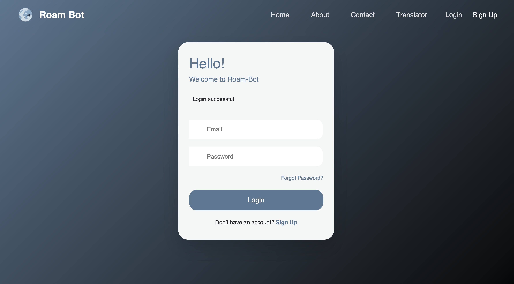
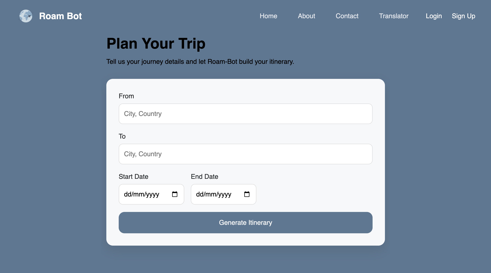
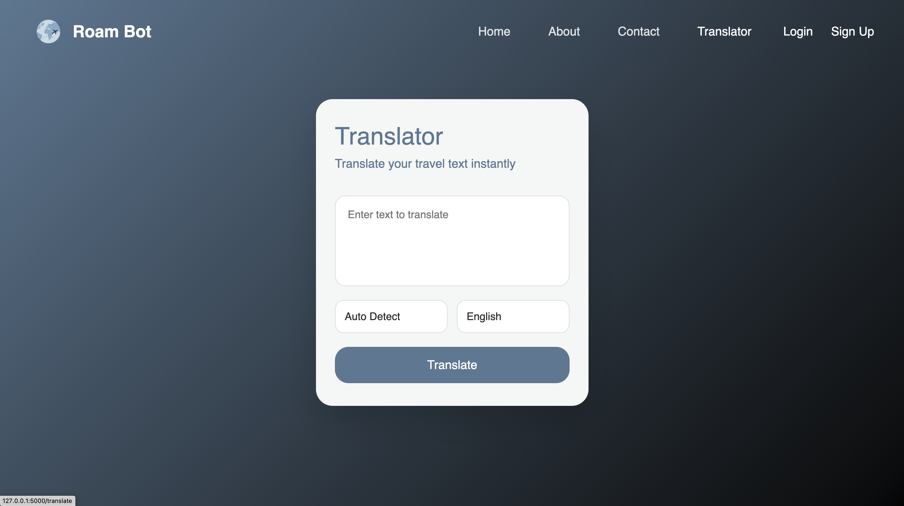
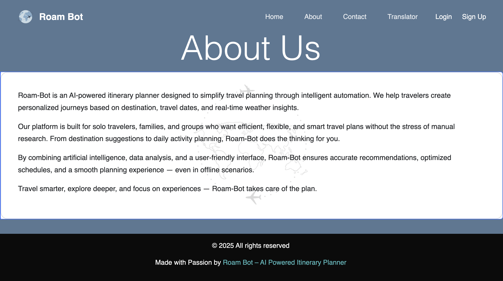
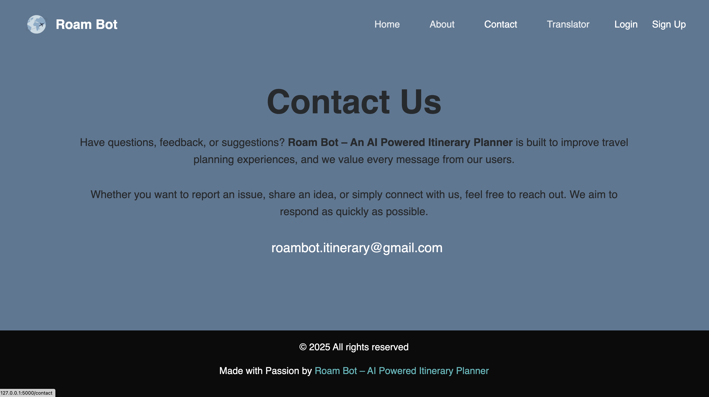

 HEAD
# Roam Bot – AI-Powered Travel Itinerary Planner

Roam Bot is a Flask-based web application that generates personalized travel itineraries using AI.
Users can input their source, destination, and travel dates to receive a multi-day itinerary along with supporting travel utilities.

---

## 📸 Screenshots

### 🏠 Home Page


### 🔐 Login Page


### 📝 Sign Up Page


### 🗺️ Itinerary Generation


### 🌐 Language Translator


### ℹ️ About Page


### 📩 Contact Page


---

## 🚀 Features

- AI-generated travel itineraries based on user input
- Weather forecast integration using OpenWeather API
- User authentication (Register / Login)
- Translator tool for multi-language assistance
- Session-based trip planning
- Clean, responsive UI

---

## 🛠️ Tech Stack

**Frontend**
- HTML
- CSS
- JavaScript

**Backend**
- Python
- Flask
- Flask SQLAlchemy
- SQLite

**AI Integration**
- Google Gemini API (LLM-based itinerary generation)

**APIs**
- OpenWeather API
- Google Gemini API

---

## 📂 Project Structure


=======
Roam Bot/
│
├── app.py
├── bard.py
├── database.db
├── requirements.txt
├── .env
├── .gitignore
├── README.md
│
├── templates/
│ ├── index.html
│ ├── planner.html
│ ├── dashboard.html
│ ├── login.html
│ ├── register.html
│ ├── translate.html
│ ├── about.html
│ ├── contact.html
│ └── 404.html
│
├── static/
│ ├── css/
│ └── images/
│
└── screenshots/

## 🧠 How AI Is Used

Roam Bot uses **Google Gemini (LLM)** to generate travel itineraries.  
Based on user inputs (source, destination, trip duration), the model generates a structured itinerary covering multiple days with suggested activities.

The AI logic is implemented in `bard.py` and called from the dashboard route.

---

## 🔐 Environment Variables

Create a `.env` file in the root directory:

```env
SECRET_KEY=your_secret_key
WEATHER_API_KEY=your_openweather_api_key
GOOGLE_API_KEY=your_gemini_api_key
